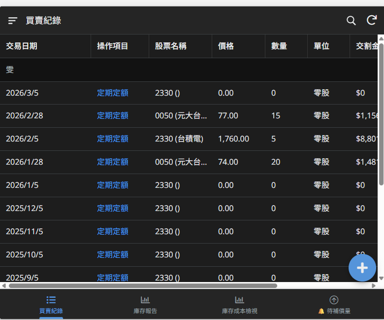
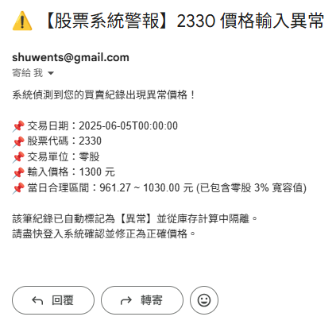
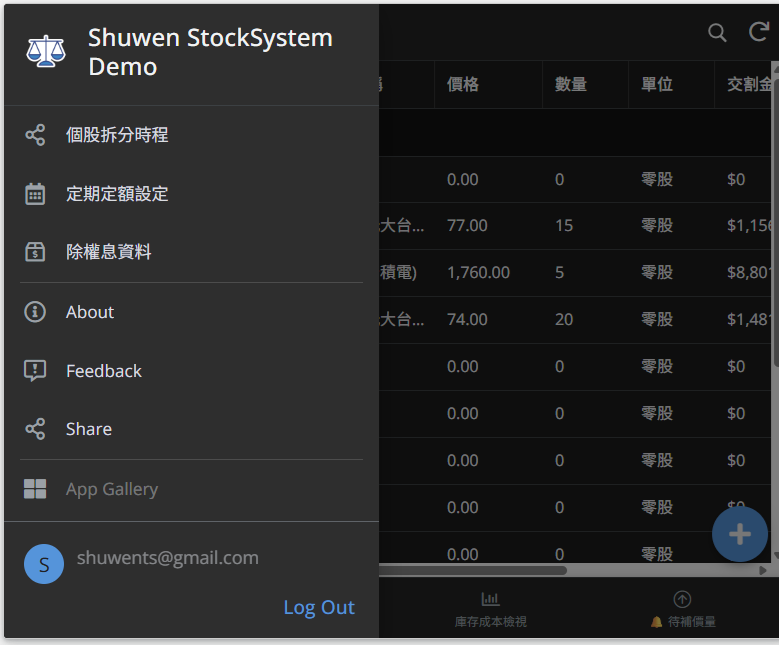
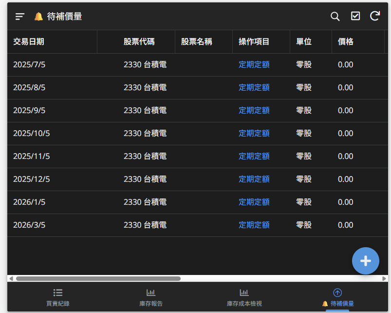
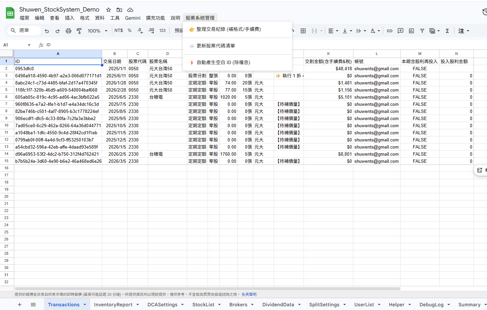
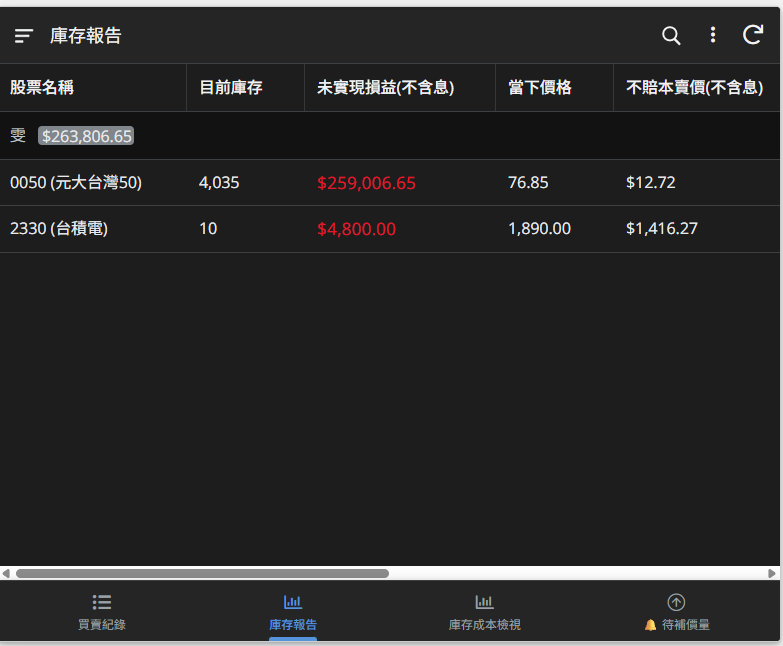

# 📈 個人投資管理系統 (Stock Portfolio Manager)

> **「讓投資人專注於市場決策，將繁瑣的帳務與庫存運算交給全自動化系統。」**

## 💡 產品願景 (Product Vision)
傳統的 Excel 記帳方式容易出錯、難以在手機上操作，且遇到「股票分割」或「定期定額」時，需要耗費大量時間手動重算成本。
本專案透過 **AppSheet (前端 App)** 結合 **Google Apps Script (後端自動化引擎)**，打造出一款 Mobile-First 的個人投資管理 App。它不僅提供流暢的操作介面，更內建了金融級的防呆機制與全自動的庫存結算功能。

---

## 🎯 痛點與解決方案 (Pain Points & Solutions)

| 傳統記帳痛點 (Pain Point) | 本系統解決方案 (Our Solution) |
| :--- | :--- |
| ❌ **容易手滑輸入錯誤價格**，導致整張報表成本失真。 | ✅ **內建智慧防呆機制**：動態抓取當日最高/最低價比對，並具備「零股溢價 3%」的寬容機制，輸入異常時自動隔離並發送 Email 警報。 |
| ❌ **定期定額 (DCA)** 每個月都要手動輸入，常忘記補單。 | ✅ **自動化排程器**：只需設定一次，系統每晚自動巡邏，時間一到自動產出待補單據。 |
| ❌ **股票分割 (Stock Split)** 會讓歷史成本與股數大亂。 | ✅ **時光機結算引擎**：精準回溯分割當下的各帳號實際庫存，自動按比例放大股數，無需手動修改歷史單據。 |
| ❌ 手機查看 Excel 報表字體過小，操作不便。 | ✅ **AppSheet 原生介面**：提供即時的投資組合儀表板、一鍵跳轉表單，將 UI 與底層資料庫完美分離。 |

---

## ✨ 核心產品功能 (Core Features)

### 1. 🛡️ 企業級資料防護與防呆 (Data Validation & Alerting)
* **前端介面鎖定**：利用 AppSheet 的 Virtual Columns (虛擬欄位) 與 View 權限控制，隱藏不必要的系統欄位，確保使用者只能填寫有效資料。
* **零股/整股動態容錯**：後端引擎會根據交易單位 (整張/零股) 動態調整價格合理區間，完美適應台股零股交易的真實市場狀況。
  
* **即時推播警報**：一旦偵測到呆帳 (如台積電輸入 9999 元)，系統會立即標記【異常】、將該筆紀錄移出庫存計算，並自動寄發 Email 通知使用者除錯。
  
  

### 2. 🤖 自動化投資助理 (Automated Investment Assistant)
* **定期定額生命週期管理**：支援設定「預計停扣日」，系統自動計算並於每月指定日生成單據，再由使用者於前端 App 點擊「🚀 立即產出單據」一鍵確認。
  
  
  
* **一鍵除權息管理**：提供專屬的 Google Sheet UI 選單，使用者只需輸入配息金額，系統自動生成唯一識別碼 (UUID) 並重新計算含息成本。
  

### 3. 📊 多維度庫存報表 (Multi-dimensional Reporting)
* **帳號與券商獨立結算**：無論您在幾個不同的券商開戶，系統皆能精準分拆各帳戶的持有成本與未實現損益。
* **淨現金與含息成本追蹤**：自動將歷年領取的現金股利從投入成本中扣除，真實呈現「不賠本賣價」。
 

---

## 🛠️ 系統架構簡介 (System Architecture Overview)

本系統採用**前後端分離 (Decoupled Architecture)** 的設計模式：
1. **Frontend (Presentation Layer)**: 基於 `AppSheet` 開發，負責表單驗證、資料切片 (Slices) 與行動端視覺呈現。
2. **Backend (Data & Logic Layer)**: 基於 `Google Sheets` 作為資料庫，`Google Apps Script (GAS)` 作為核心運算引擎。
3. **Automation (Triggers)**: 透過 AppSheet Bots 偵測資料變動，觸發後端的 GAS 腳本進行複雜的跨表重算與 Email 發送。

---

## 🚀 未來展望 (Roadmap)
* [ ] 整合 Google Finance API，實現盤中資產總值即時監控。
* [ ] 導入 AI 助手 (LLM API)，透過自然語言輸入自動解析並生成買賣紀錄。
